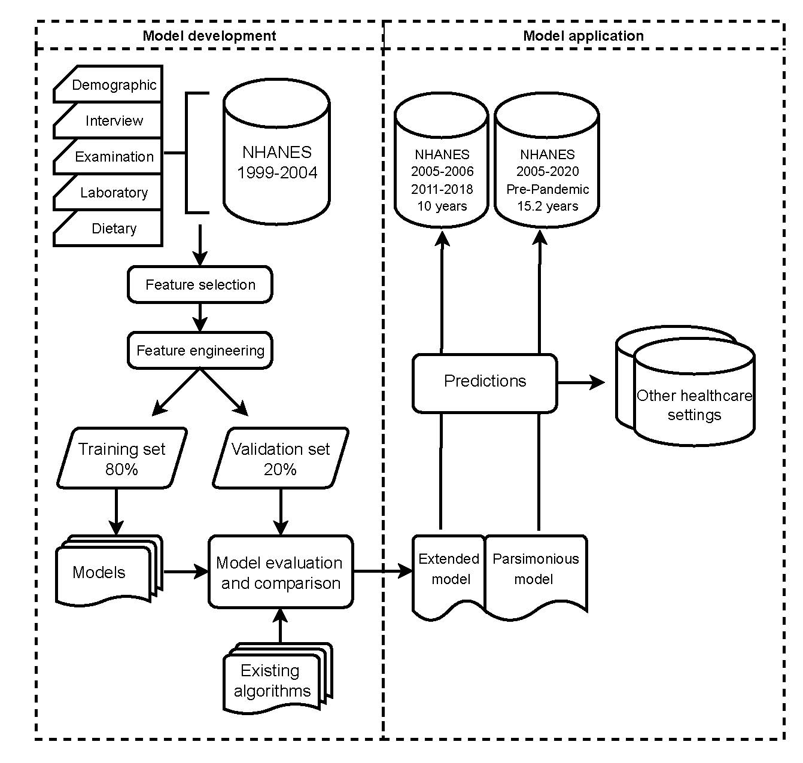

## Nonexercise machine learning models for maximal oxygen uptake prediction in national population surveys


This repository contains the (partial) code and data for the JAMIA paper **Nonexercise machine learning models for maximal oxygen uptake prediction in national population surveys** [paper link](https://academic.oup.com/jamia/article/30/5/943/7076269). For simplicity, we only provide the code for collecting and preprocessing the data, and training the data with the final chosen LightGBM model. The code for different model comparsion and evaluation is not provided here.

<p align="center">
  
</p>


## 0. Environment setup
Create a virtual environment nhanes_crf_model with requirements satisfied and then activate it with the following command:
```bash
conda env create -f environment.yaml # name: nhaens_crf_model
conda activate nhanes_crf_model
```
### 1. Data
The data used in this study is from the National Health and Nutrition Examination Survey [(NHANES)](https://wwwn.cdc.gov/nchs/nhanes/Default.aspx).To crawl the data we need, run through the `./src/nhanes_vo2max_reg_data_crawling.Rmd` file to get the raw data and store them in `./data/raw`. The data is then preprocessed used`./src/data_preproces.Rmd` file. The preprocessed data, including the splitted train test set, and the data (2005-2020) to be predicted, are saved in the `./data/processed` folder.

####  Variable definition

Below is the table summarized the variables used in the model training and prediction. 

<style>
table {
    width: 100%;
    font-size: small;
}
th, td {
    padding: 5px;
    text-align: left;
}
th {
    background-color: #f2f2f2;
}
</style>


| Predictor variable                           | Section      | Data type | Ascertainment in NHANES                                                                              | Definition of variables used in analysis                                                                                                                                                        | Missing rate (%) |
|----------------------------------------------|--------------|-----------|------------------------------------------------------------------------------------------------------|--------------------------------------------------------------------------------------------------------------------------------------------------------------------------------------------------|------------------|
| **Parsimonious Model**                       |              |           |                                                                                                      |                                                                                                                                                                                                  |                  |
| Age                                          | Demographic  | Continuous| Best age in years of the sample person at the time of HH screening. Individuals 85 and over are top coded at 85 years of age. Related NHANES variable: RIDAGEYR (1999-2020)                        | Age in years of the sample person at time of HH screening.                                                                                                                                       | 0                |
| Gender                                       | Demographic  | Binary    | Gender of the sample person Related NHANES variable: RIAGENDR (1999-2020)                                                                  | Gender is classified as: Male, Female                                                                                                                                                           | 0                |
| Race and ethnicity                           | Demographic  | Categorical| Reported race and ethnicity information. Related NHANES variable: RIDRETH1 (1999-2020)                                                      | Race and ethnicity is classified: Non-Hispanic White, Non-Hispanic Black, Hispanic, Others                                                                                                       | 0                |
| Poverty income ratio                         | Demographic  | Continuous| Poverty income ratio (PIR) - a ratio of family income to poverty threshold. PIR values greater than or equal to 5.00 are top coded as 5.0. Related NHANES variable: INDFMPIR (1999-2020)          | The ratio of family income to poverty threshold                                                                                                                                                 | 7.9              |
| Family income                                | Demographic  | Binary    | Index for the ratio of family income to poverty. Related NHANES variable: INDFMPIR (1999-2020)                                                | Based on the poverty income ratio relative to the federal poverty limit from the Census Bureau family income is categorized as: High/middle income [≥2], Low-income [<2]                        | 7.9              |
| Marital status                               | Demographic  | Binary    | Marital Status. Marital status data were collected for sample persons 14 years of age and older Related NHANES variable: DMDMARTL (1999-2020) | Marital status is classified as: married/ living with partners, others (widowed, divorced, or separated; and never married).                                                                    | 2.1              |
| Highest education level                      | Demographic  | Categorical| Highest grade or level of school completed or the highest degree received? Related NHANES variable: DMDEDUC2 (1999-2020), DMDEDUC3 (1999-2020) | Highest education level is classified as: Less than high school, High school, Greater than high school                                                                                          | 0.0              |
| Health insurance                             | Questionnaire| Binary    | In-person interview: Are you covered by health insurance or some other kind of health care plan? Related NHANES variable: HID010 (1999-2004), HIQ011 (2005-2020)                                   | Health insurance is classified: 1: if participant answered “Yes”, 0: if participant answered “No”                                                                                               | 1.7              |
| Smoking status                               | Questionnaire| Categorical| Ever smoke cigarettes in entire life (SMQ620, SMQ620), Smoked at least 100 cigarettes in life (SMQ020), Do you now smoke cigarettes? (SMQ040), Used tobacco/nicotine last 5 days? (SMD680, SMQ680, SMQ681) Related NHANES variable: SMQ020 (1999-2020), SMQ040 (1999-2020), SMQ620 (1999-2010), SMQ621 (2011-2020), SMD680 (1999-2001), SMQ680 (2001-2012), SMQ681 (2013-2020) | Smoking status is defined as: Never smoker: defined as individuals who stated they have never smoked cigarettes in entire life or smoked less than 100 cigarettes in life. Former smokers: defined as individuals who stated they had smoked cigarettes or smoked at least 100 cigarettes in life but in the meantime stated they do not smoke now or did not use tobacco/nicotine last 5 days Current smokers: defined as individuals who stated they smoke now or used tobacco/nicotine last 5 days | 1.9              |
| Total weekly moderate-intensity activity time (TWMT) | Questionnaire| Continuous | 1999-2005: Over the past 30 days did any vigorous activities for at least 10 minutes that caused heavy sweating or large increases in breathing or heart rate? Some examples are running, lap swimming, aerobics classes, or fast bicycling (PAD200) Over the past 30 days did any moderate activities for at least 10 minutes that cause only light sweating or a slight to moderate increase in breathing or heart rate? Some examples are brisk walking, bicycling for pleasure, golf, and dancing. (PAD320) Reported intensity level of activity (PADLEVEL) Frequency of the activity (PADTIMES) On average about how long for the activity each time? (PADTIMES) 2007-2020: Exclude the work and transportation activities do any vigorous-intensity sports, fitness, or recreational activities that cause large increases in breathing or heart rate like running or basketball for at least 10 minutes continuously? (PAQ650) Do any moderate-intensity sports, fitness, or recreational activities that cause a small increase in breathing or heart rate such as brisk walking, bicycling, swimming, or golf for at least 10 minutes continuously? (PAD665) In a typical week on how many days do vigorous-intensity sports, fitness, or recreational activities? (PAQ655) In a typical week on how many days do moderate-intensity sports, fitness, or recreational activities? (PAD670) How much time spent on doing vigorous-intensity sports, fitness, or recreational activities on a typical day? (PAD660) How much time spent on doing moderate-intensity sports, fitness, or recreational activities on a typical day? (PAD675) | The time of vigorous-intensity activity is equivalent to twice the time of moderate-intensity activity. Moderate-intensity aerobic activity time can be approximated by 2 times vigorous-intensity activity time. Total weekly moderate-intensity activity time is calculated as in a typical week total moderate-intensity activity time which adds up the original moderate-intensity activity time and the equivalent moderate-intensity activity time from vigorous activity. | 0.0              |
| Physical activity                            | Questionnaire| Categorical| Based on the NHANES variables previously defined total weekly moderate-intensity activity time (TWMT) and TWMT itself.                                  | Physical activity is classified as: Recommended: 150 min or more of TWMT, Insufficient: TWMT between 10-149 min, Inactive: no participation or less than 10 min of TWMT                         | 0.0              |
| Weekly Walk/bicycle times (days)             | Questionnaire| Continuous | Over the past 30 days walked or bicycled as part of getting to and from work or school or to do errands? (PAD020) Over the past 30 days how often walk or bicycle as part of getting to and from work or school or to do errands PROBE: How many times per day per week or per month do these activities? (PAQ050Q) Walk or use a bicycle for at least 10 minutes continuously to get to and from places? (PAQ635) In a typical week on how many days walk or bicycle for at least 10 minutes continuously to get to and from places? (PAD640) Related NHANES variable: PAD020 (1999-2006), PAD640 (2007-2018) | Using the frequency and time to generate the weekly Walk/bicycle times (in days) ranging from 0 to 7 days.                                                                                       | 0.0              |
| Try to lose weight last year                 | Questionnaire| Binary    | During the past 12 months tried to lose weight? (WHQ070) Related NHANES variable: WHQ070 (1999-2020)                                                | Coded as: 1: if participant answered “Yes”, 0: if participant answered “No”                                                                                                                      | 9.0              |
| Weight difference current with last year     | Questionnaire| Continuous | Self-reported weight - 1 year ago (pounds) (WHD050), Current self-reported weight (pounds) (WHD020) Related NHANES variable: WHD020 (1999-2020), WHD050 (1999-2020) | Current self-reported weight minus the self-reported weight 1 year ago.                                                                                                                          | 2.4              |
| Exercised to lose weight / keep from gaining weight | Questionnaire| Binary    | Did you exercise to weight? (WHD080D) What did you do to keep from gaining weight? (WHD100D) Related NHANES variable: WHD080D (1999-2020), WHD100D (1999-2020) | Coded as: 1: if participant answered “Yes” or provided the code for exercise. 0: if participant answered “No” or did not response                                                               | 2.7              |
| History of hypertension                      | Questionnaire| Binary    | Has a doctor or other health professional ever told you that you had hypertension also called high blood pressure? Related NHANES variable: BPQ020 (1999-2020) | Coded as: 1: if participant answered “Yes”, 0: if participant answered “No” or did not response.                                                                                                | 2.3              |
| SBP                                          | Examination  | Continuous| Systolic: Blood pressure mm Hg Related NHANES variable: BPXSYx (1999-2020 x denotes the xth reading)                                                    | Averaged systolic blood pressure over all readings.                                                                                                                                             | 0.0              |
| DBP                                          | Examination  | Continuous| Diastolic: Blood pressure mm Hg Related NHANES variable: BPXDIx (1999-2020 x denotes the xth reading)                                                  | Averaged diastolic blood pressure over all readings.                                                                                                                                            | 0.0              |
| BMI                                          | Examination  | Continuous| Body Mass Index (kg/m^2) Related NHANES variable: BMXBMI (1999-2020)                                                                                    | Body Mass Index (kg/m^2)                                                                                                                                                                        | 0.4              |
| Waist circumference                          | Examination  | Continuous| Waist Circumference (cm) Related NHANES variable: BMXWAIST (1999-2020)                                                                                 | Waist Circumference (cm)                                                                                                                                                                        | 0.8              |
| Pulse rate (60s)                             | Examination  | Continuous| 60-seccond pulse Related NHANES variable: BMXWAIST (1999-2020)                                                                                          | 60-second pulse                                                                                                                                                                                | 0                |
| Weight (kg)                                  | Examination  | Continuous| Weight (kg) Related NHANES variable: BMXWAIST (1999-2020)                                                                                               | Weight (kg)                                                                                                                                                                                     | 0.4              |
| Height (cm)                                  | Examination  | Continuous| Standing height (cm) Related NHANES variable: BMXHT (1999-2020)                                                                                         | Standing height (cm)                                                                                                                                                                            | 0.4              |
| **Extended model (Features added additionally on top of the parsimonious model)** |              |           |                                                                                                      |                                                                                                                                                                                                  |                  |
| Arm fat (%)                                  | Examination  | Continuous| Averaged Arm Percent Fat Related NHANES variable: DXDRAPF (1999-2005, 2011-2018), DXDLAPF (1999-2005, 2011-2018)                                        | Averaged Arm Percent Fat = DXDRAPF+DXDLAPF / 2                                                                                                                                                   | 3.2              |
| Arm BMD                                      | Examination  | Continuous| Averaged Arm Body Mineral Density (grams/cm^2) Related NHANES variable: DXXRABMD (1999-2005, 2011-2018), DXXLABMD (1999-2005, 2011-2018)                | Averaged Arm Body Mineral Density (grams/cm^2) = DXXRABMD+DXXLABMD / 2                                                                                                                          | 3.2              |
| Arm lean                                     | Examination  | Continuous| Averaged Arm Lean excl Bone Mineral Content (grams) Related NHANES variable: DXDLALE (1999-2005, 2011-2018), DXDRALE (1999-2005, 2011-2018)              | Averaged Arm Lean excl Bone Mineral Content (grams)= DXDLALE+DXDRALE / 2                                                                                                                         | 3.2              |
| Leg fat (%)                                  | Examination  | Continuous| Averaged Leg Percent Fat Related NHANES variable: DXDLLPF (1999-2005, 2011-2018), DXDRLPF (1999-2005, 2011-2018)                                         | Averaged Leg Percent Fat = DXDLLPF+DXDRLPF / 2                                                                                                                                                   | 3.2              |
| Leg BMD                                      | Examination  | Continuous| Averaged Leg Lean excl Bone Mineral Content (grams) Related NHANES variable: DXXLLBMD (1999-2005, 2011-2018), DXXRLBMD (1999-2005, 2011-2018)             | Averaged Arm Lean excl Bone Mineral Content (grams)= DXXLLBMD+DXXRLBMD / 2                                                                                                                       | 3.2              |
| Leg lean                                     | Examination  | Continuous| Averaged Leg Lean excl Bone Mineral Content (grams) Related NHANES variable: DXDLLLE (1999-2005, 2011-2018), DXDRLLE (1999-2005, 2011-2018)               | Left Leg Lean excl Bone Mineral Content (grams) DXDLLLE+DXDRLLE / 2                                                                                                                             | 3.2              |
| Trunk fat (%)                                | Examination  | Continuous| Trunk Percent Fat Related NHANES variable: DXDTRPF (1999-2005, 2011-2018)                                                                                | Trunk Percent Fat = DXDTRPF                                                                                                                                                                     | 3.2              |
| Trunk BMD                                    | Examination  | Continuous| Trunk Bone BMD (g/cm^2) Related NHANES variable: DXDTRBMD (1999-2005, 2011-2018)                                                                         | Trunk Bone BMD (g/cm^2) = DXDTRBMD                                                                                                                                                              | 3.2              |
| Trunk lean                                   | Examination  | Continuous| Trunk Lean excl Bone Mineral Content (grams) Related NHANES variable: DXDTRLE (1999-2005, 2011-2018)                                                    | Trunk Lean excl Bone Mineral Content (grams)= DXDTRLE                                                                                                                                           | 3.2              |
| Alanine Aminotransferase (ALT)               | Laboratory   | Continuous| Alanine aminotransferase ALT (U/L) Related NHANES variable: LBXSATSI (1999-2020)                                                                         | Alanine aminotransferase ALT (U/L)                                                                                                                                                              | 5.0              |
| Aspartate Aminotransferase (AST)             | Laboratory   | Continuous| Aspartate aminotransferase AST (U/L) Related NHANES variable: LBXSASSI (1999-2020)                                                                        | Aspartate aminotransferase AST (U/L)                                                                                                                                                            | 5.0              |
| Blood Urea Nitrogen (BUN)                    | Laboratory   | Continuous| Blood urea nitrogen (mg/dL) Related NHANES variable: LBXSBU (1999-2020)                                                                                   | Blood urea nitrogen (mg/dL)                                                                                                                                                                     | 4.9              |
| Glucose                                      | Laboratory   | Continuous| Glucose refrigerated serum (mg/dL) Related NHANES variable: LBXSGL (1999-2020)                                                                            | Glucose refrigerated serum (mg/dL)                                                                                                                                                              | 4.9              |
| Lactate Dehydrogenase (LDH)                  | Laboratory   | Continuous| Lactate dehydrogenase (U/L) Related NHANES variable: LBXSLDSI (1999-2000, 2003-2018), LBDSLDSI (2001-2002)                                               | Lactate dehydrogenase (U/L)                                                                                                                                                                     | 5.0              |
| Cholesterol                                  | Laboratory   | Continuous| Total Cholesterol refrigerated serum (mg/dL) Related NHANES variable: LBXSCH (1999-2020)                                                                 | Total Cholesterol refrigerated serum (mg/dL)                                                                                                                                                     | 4.9              |
| Total protein                                | Laboratory   | Continuous| Total protein (g/dL) Related NHANES variable: LBXSTP (1999-2020)                                                                                          | Total protein (g/dL)                                                                                                                                                                            | 5.0              |
| Potassium                                    | Laboratory   | Continuous| Potassium (mmol/L) Related NHANES variable: LBXSKSI (1999-2020)                                                                                           | Potassium (mmol/L)                                                                                                                                                                              | 5.0              |
| Sodium                                       | Laboratory   | Continuous| Sodium (mmol/L) Related NHANES variable: LBXSNASI (1999-2020)                                                                                            | Sodium (mmol/L)                                                                                                                                                                                 | 4.9              |
| Chloride                                     | Laboratory   | Continuous| Chloride (mmol/L) Related NHANES variable: LBXSCLSI (1999-2020)                                                                                           | Chloride (mmol/L)                                                                                                                                                                               | 5.0              |
| Albuminuria                                  | Laboratory   | Continuous| Albumin urine (mg/L), Creatinine urine (mg/dL) Related NHANES variable: URXUMS (2005-2020), URXUMA (1999-2004), URXUMS (1999-2020)                        | Albuminuria = Albumin urine (mg/L)Creatinine urine (mg/dL)*100                                                                                                                                   | 10.4             |
| HBA1C                                        | Laboratory   | Continuous| Glycohemoglobin (%) Related NHANES variable: LBXGH (1999-2020)                                                                                            | Glycohemoglobin (%)                                                                                                                                                                             | 3.9              |
| Creatinine                                   | Laboratory   | Continuous| Creatinine (mg/dL) Related NHANES variable: LBXSCR (1999-2000, 2003-2020), LBDSCR (2001-2002)                                                             | Creatinine (mg/dL)                                                                                                                                                                              | 4.9              |
| Bilirubin                                    | Laboratory   | Continuous| Bilirubin total (mg/dL) Related NHANES variable: LBXSTB (1999-2000, 2003-2020), LBDSTB (2001-2002)                                                        | Bilirubin total (mg/dL)                                                                                                                                                                         | 5.0              |
| Calcium                                      | Laboratory   | Continuous| Calcium total (mg/dL) Related NHANES variable: LBXSCA (1999-2020)                                                                                         | Calcium total (mg/dL)                                                                                                                                                                           | 4.9              |
| Bicarbonate                                  | Laboratory   | Continuous| Bicarbonate (mmol/L) Related NHANES variable: LBXSC3SI (1999-2020)                                                                                        | Bicarbonate (mmol/L)                                                                                                                                                                            | 4.9              |
| Alcohol intake                               | Questionnaire| Categorical| In-person interview: In entire life had at least 12 drinks of any type of alcoholic beverage. (ALQ110, ALQ111) In any one year had at least 12 drinks of any type of alcoholic beverage. (ALQ100, ALD100) In the past 12 months on those days that drank alcoholic beverages on the average how many drinks did you have (ALQ130) For the Past 12 months how often do you have alcohol drink (ALQ120U, ALQ120Q, ALQ121) Use variables above calculate averaged daily drinks/alcohol intake Related NHANES variable: ALQ100 (1999-2000), ALD100 (2001-2002), ALQ101 (2003-2016), ALQ111 (2017-2018), ALQ110 (1999-2016), ALQ110 (1999-2016), ALQ120 (1999-2016), ALQ110 (1999-2016), ALQ121 (2017-2018) | Alcohol intake status is categorized as: Never drinkers: defined as individuals who stated never had any kind of alcohol drink or had less than 12 drinks of any type in entire life Former drinkers: defined as individuals who stated they had had at least 12 drinks but did not drink for the past 12 months. Light drinkers: defined as individuals who self-reported 0-0.5 average daily drinks. Moderate drinkers: defined as individuals who self-reported (0.5-1.5 for women; 0.5-2.5 for men) average daily drinks. Heavy drinkers: defined as individuals who self-reported (1.5+ for women; 2.5+ for men) average daily drinks. | 8.3              |


### 2. Model training
* Run the command:
  ```bash 
  python3 ./src/lgb_model_train.py
  ```
  to train the model. The script will train two LightGBM models `lgb_extended` and `lgb_parsimonious` with different variable sets. The hyperparameters are chosen by 100 times random search. The trained model is saved in the `./model` folder. This might run quite slow only using your laptop, 
* You can use the notebook version `./notebook/lightgbm_model_train_clean.ipynb` to make use of google colab to do the model training.


### 3. Prediction
* Run the command:
  ```bash 
  python3 ./src/predict_vo2max_2005_2020_parsimonious.py
  ```
  to predict the VO2max of the eligible NHANES participants from 2005 to 2020. The prediction result is saved in `./prediction/predicted_vo2max_2005_2020_parsimonious.csv` 
* Can also use the notebook version `./notebook/nhanes_parsimonious_lgb_16years_prediction.ipynb` to make use of google colab to do the prediction.


